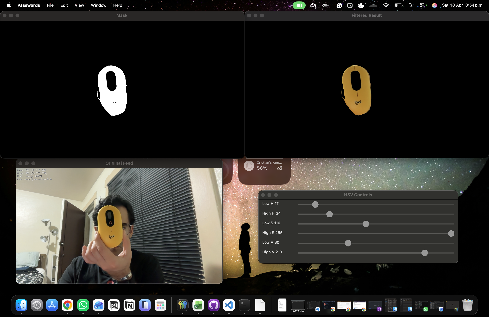

# Real-Time Color Detection

[](https://www.python.org/)
[](https://opencv.org/)
[](https://github.com/crisdanrodriguez/realtime-color-detection/actions/workflows/tests.yml)
[](https://github.com/crisdanrodriguez/realtime-color-detection/blob/main/LICENSE)

Lightweight OpenCV CLI for calibrating HSV color ranges in real time from a webcam feed.

## Table of Contents

- [Overview](#overview)
- [Installation](#installation)
- [Usage](#usage)
- [Project Structure](#project-structure)
- [Results](#results)
- [Documentation](#documentation)
- [Development](#development)
- [License](#license)
- [AI Assistance and Last Updated](#ai-assistance-and-last-updated)

## Overview

This repository contains a small Python application for interactive HSV tuning with OpenCV. It is designed for computer vision prototyping, quick webcam-based experiments, and educational demos where seeing the live mask and filtered result is more useful than building a larger pipeline.

Current scope:

- Real-time webcam capture
- Interactive HSV trackbars
- Live mask and filtered output windows
- Optional blur and morphological cleanup
- CLI options for camera backend, resolution, and initial HSV bounds

## Installation

Requirements:

- Python 3.10+
- A working webcam

Recommended setup:

```bash
python3 -m venv .venv
source .venv/bin/activate
pip install .
```

Development setup:

```bash
python3 -m venv .venv
source .venv/bin/activate
pip install -e .[dev]
```

Alternative runtime install:

```bash
pip install -r requirements.txt
```

## Usage

Run the packaged CLI:

```bash
realtime-color-detection
```

Run as a module:

```bash
python -m realtime_color_detection
```

Example with custom options:

```bash
realtime-color-detection \
  --camera 0 \
  --backend auto \
  --width 1280 \
  --height 720 \
  --lower-hsv 35,80,80 \
  --upper-hsv 85,255,255 \
  --blur-kernel 5 \
  --morph-kernel 5
```

Controls:

- `q` closes the application
- `r` resets the HSV sliders to the initial range

## Project Structure

```text
realtime-color-detection/
├── .github/
│   ├── ISSUE_TEMPLATE/
│   └── workflows/
├── docs/
│   ├── demo.png
│   └── implementation-notes.md
├── realtime_color_detection/
│   ├── __init__.py
│   ├── __main__.py
│   └── app.py
├── tests/
│   └── test_core.py
├── .editorconfig
├── .gitattributes
├── .gitignore
├── LICENSE
├── pyproject.toml
├── README.md
└── requirements.txt
```

## Results

Demo preview:



The application opens separate windows for the original feed, the binary mask, and the filtered output, making it practical for HSV threshold calibration and quick visual debugging.

## Documentation

- [Implementation Notes](docs/implementation-notes.md)

## Development

Run tests:

```bash
pytest -v
```

Build the package:

```bash
python -m build
```

Notes:

- The automated test suite focuses on parser and utility behavior.
- Camera access is intentionally not exercised in CI because it depends on local hardware and OS permissions.

## License

This project is released under the [MIT License](LICENSE).

## AI Assistance and Last Updated

AI tools were used to help refine repository structure, packaging, tests, and documentation. All documentation in this repository is intended to reflect the current state of the codebase rather than aspirational features.

Last updated: 2026-04-19
